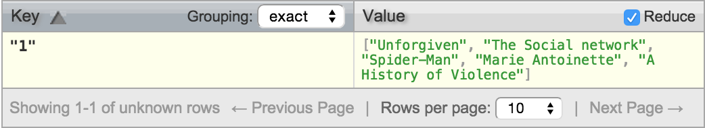

##Exercises 20.1.1

#####1. Give all titles.
Function:
```
function(doc){
	emit(doc.title, doc.title);
}
```
View:
</img>

cURL request:

```
curl $COUCHDB/movies/_design/examples/_view/titles
```

cURL request response:

```
{"total_rows":5,"offset":0,"rows":[
{"id":"ahv","key":"A History of Violence","value":"A History of Violence"},
{"id":"ma","key":"Marie Antoinette","value":"Marie Antoinette"},
{"id":"sm","key":"Spider-Man","value":"Spider-Man"},
{"id":"tsn","key":"The Social network","value":"The Social network"},
{"id":"un","key":"Unforgiven","value":"Unforgiven"}
]}
```

#####2. Titles of the movies published after 2000.

#####3. Summary of “Spider-Man”.

#####4. Who is the director of Heat?

#####5. Title of the movies featuring Kirsten Dunst.

#####6. What was the role of Clint Eastwood in Unforgiven?

#####7. Get the movies whose cast consists of exactly three actors?

#####8. Create a flat list of all the title-role pairs. (Hint: recall that you can emit several pairs in a MAP function.)

#####9. Get a movie given its title. (Hint: create a view where movies are indexed by their title, then query the view.)

#####10. Get the movies featuring an actor’s name.

#####11. Get the title of movies published a given year or in a year range.

#####12. Show the movies where the director is also an actor.

#####13. Show the directors, along with the list of their films.

#####14. Show the actors, along with the list of directors of the film they played in.
