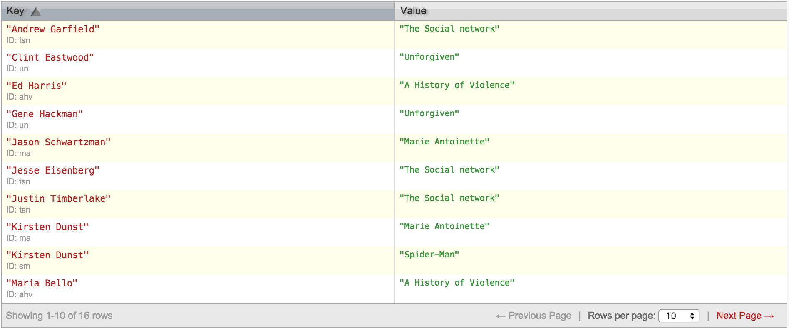

##Exercises 20.1.1
All views are saved in _design/examples Design Document and given individual view names.
</img>

#####1. Give all titles.
Map and Reduce Functions (saved with view name "titles"):
```
function(doc){
	emit("1", doc.title);
}

function (key, values) {
	return values; 
}
```
View (with reduction):
</img>

cURL request:

```
curl $COUCHDB/movies/_design/examples/_view/titles?group=true
```

cURL request response:

```
{"rows":[
	{"key":"1","value":
		["Unforgiven","The Social network","Spider-Man","Marie Antoinette","A History of Violence"]
	}
]}
```

#####2. Titles of the movies published after 2000.

#####3. Summary of “Spider-Man”.
Map Function (saved with view name "summaries"):
```
function(doc){
	emit(doc.title, doc.summary);
}
```
View:
</img>

cURL request:

```
curl $COUCHDB/movies/_design/examples/_view/summaries?key=\"Spider-Man\"
```

cURL request response:

```
{"total_rows":5,"offset":2,"rows":[
	{"id":"sm","key":"Spider-Man","value":"On a school field trip, Peter Parker (Maguire) is  bitten by a genetically modified spider. He wakes  up the next morning with incredible powers. After  witnessing the death of his uncle (Robertson),  Parkers decides to put his new skills to use in  order to rid the city of evil, but someone else  has other plans. The Green Goblin (Dafoe) sees  Spider-Man as a threat and must dispose of him."}
]}
```
#####4. Who is the director of Heat?

#####5. Title of the movies featuring Kirsten Dunst.
Map Function (saved with view name "movies_by_actor"):
```
function(doc){
	for each (actor in doc.actors){
		emit(actor.first_name+ " "+actor.last_name, doc.title);
	}
}
```
View:
</img>

cURL request:

```
curl $COUCHDB/movies/_design/examples/_view/movies_by_actor?key=\"Kirsten%20Dunst\"
```

cURL request response:

```
{"total_rows":16,"offset":7,"rows":[
	{"id":"ma","key":"Kirsten Dunst","value":"Marie Antoinette"},
	{"id":"sm","key":"Kirsten Dunst","value":"Spider-Man"}
]}
```
#####6. What was the role of Clint Eastwood in Unforgiven?

#####7. Get the movies whose cast consists of exactly three actors?
Map and Reduce Functions (saved with view name "movies_num_actors"):
```
function(doc){
	emit(doc.actors.length, doc.title);
}

function(key,values){
	return values;
}
```
View (with reduction):
</img>

cURL request:

```
curl $COUCHDB/movies/_design/examples/_view/movies_num_actors?group=true\&key=3
```

cURL request response:

```
{"rows":[
	{"key":3,"value":["Unforgiven","Spider-Man"]}
]}
```
#####8. Create a flat list of all the title-role pairs. (Hint: recall that you can emit several pairs in a MAP function.)

#####9. Get a movie given its title. (Hint: create a view where movies are indexed by their title, then query the view.)
Map Function (saved with view name "movies_by_title"):
```
function(doc){
	emit(doc.title, doc);

}
```
View (cut off):
</img>

cURL request (example with spider-man movie):

```
curl $COUCHDB/movies/_design/examples/_view/movie_by_title?key=\"Spider-Man\"
```

cURL request response:

```
{"total_rows":5,"offset":2,"rows":[
	{"id":"sm","key":"Spider-Man","value"
		{"_id":"sm", "_rev":"1-292f38855b99af0e98fd6ccd33939909", "title":"Spider-Man", "year":"2002", "genre":"Action", "summary":"On a school field trip, Peter Parker (Maguire) is  bitten by a genetically modified spider. He wakes  up the next morning with incredible powers. After  witnessing the death of his uncle (Robertson),  Parkers decides to put his new skills to use in  order to rid the city of evil, but someone else  has other plans. The Green Goblin (Dafoe) sees  Spider-Man as a threat and must dispose of him.", "country":"USA", 
		"director":
			{"last_name":"Raimi", "first_name":"Sam", "birth_date":"1959"},
		"actors":[
			{ "first_name":"Tobey", "last_name":"Maguire", "birth_date":"1975", "role":"Spider-Man / Peter Parker"},
			{"first_name":"Kirsten", "last_name":"Dunst", "birth_date":"1982", "role":"Mary Jane Watson"},
			{"first_name":"Willem", "last_name":"Dafoe", "birth_date":"1955", "role":"Green Goblin / Norman Osborn"}
		]}
	}
]}
```
#####10. Get the movies featuring an actor’s name.

#####11. Get the title of movies published a given year or in a year range.

#####12. Show the movies where the director is also an actor.

#####13. Show the directors, along with the list of their films.

#####14. Show the actors, along with the list of directors of the film they played in.
