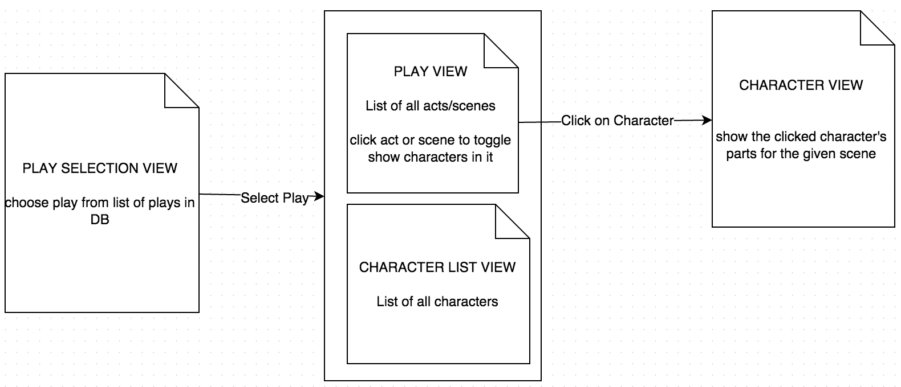

##Web Data Management Assignment 1 Writeup
Alex Simes  and Peter van Buul

###Introduction
We choose to do the exercises from Chapter 5 of the textbook. This chapter included two sets of questions to practice xQuery and xPath queries. Our solutions to these questions can be found in this repo [here](xpath_xquery_questions/queries.md).

Below, we will detail our work in solving the three larger assignments in this chapter. For each, we will discuss our process and final structure.

###Movie Database Project
This project was our first experience with using xQuery and xPath in practice. We decided to use the REST API to query our movie collection in eXist-db for this project. We used PHP to handle POST/GET requests to bring our query results into the static parts of our web application. Rather than storing our queries in eXist and calling them from the PHP code with parameters, we kept the entire query expressions in our PHP code. We did this so the application could be set on top of any eXist database with the needed collections, rather than requiring the eXist DB to also store the queries we needed. This makes our application easier to deploy on new systems. Our query results were formatted in a way such that they could easily be dropped into a web page body. We will elaborate more on this formatting below.

The requirements of this project were three-fold:
  
1. There must be a form that allows the user to search for movies based on (fragment of) the title, list of genres, director and actors names, years, and key-words that can be matched against the summary of the movie.
2. When the user submits the form, the application retrieves the relevant movies from the XML repository, and displays the list of these movies in XHTML.
3. in the previous list, each movie title should be a link that allows to display the full description of the movie.

#####Including the User Query
To allow the user to run their own search query, we built an HTML form with all of the needed fields. We had fun creating an xQuery query to fill the form's genre dropdown box with a list of genres found in the collection. You can see that code [here](apps/movies/queries/get_genre_list.php). Our query returns the unique list of genres wrapped in `<select>` and `<option>` tags so it can easily be dropped into the form.

Upon submit, the form data is sent through a POST request to a [PHP script](apps/movies/list_movies.php). This script calls a function which builds an xQuery expression based on the parameters. We will discuss this function in the section below.

##### Displaying the List of Movies in XHTML
As mentioned in the previous section, the user search parameters are passed to [a function](apps/movies/queries/get_movie_list.php) through a POST request. This function constructs the query in two parts. First, in the build_movie_query() function, we take all the search parameters and create an xPath query to show only relevant movies. For example, if the user selects a genre "Drama" and an actor "Johansson" the following xPath statement is generated:

`/movies/movie[genre = "Crime"and (contains(actor/last_name,"Johansson") or contains(actor/first_name,"Johansson"))]`

This xPath query is used in an xQuery expression which formats the relevant movies into something we can pop into our small static html wrapper. The wrapper includes things like the DOCTYPE declaration, includes, and `<html>`,`<head>`, and `<body>` tags. The xQuery expression wraps the returned information in the appropriate `
` tags and labels. The complete expression can be seen in the get_xquery() function [here](apps/movies/queries/get_movie_list.php).

We ensured that the file output page was XHTML standard approved by running it through [W3 markup validation service](https://validator.w3.org/).

##### Showing Full Description of the Movie On Click
We used a small Javascript function that toggles the html `style="display:none"` attribute. We added the attribute and the onclick that calls the javascript function in our xQuery expression. One issue we ran into was that we were unable to add an `href="#"` to make the title clickable in xQuery, so we formatted that with css afterwards. 

Below is a screenshot of our application's query result page with two movies, one of which has been expanded out by the user clicking the title. The description can be toggled to be shown or hidden for any individual movie by clicking the title.

###Shakespeare Opera Omnia Project 
This project is done based on the data included in eXist-db of a few of Shakespeare's plays. The data includes all of the spoken lines, stage directions, and act/scene structure. There were three requirements listed for this project:

1. Show the part of a given character, for a given act and/or a given scene.
2. show the table of contents of the play, along with the organization in acts and scenes, and the characters present in each scene.
3. Show a full summary of the play, including the author, list of characters, stages requirements, etc.

Part of the challenge here was to design a user-friendly way of showing all of this data. This is why we started designing what we wanted our final application structure to be before developing it. Below is the a diagram of the application flow we decided to use to incorporate all of the requirements.

#####How Did We Do It?
The techniques we used in this project are similar to what we used in the first project. First, we used xPath expressions to select the correct xml nodes we needed. Then, we used xQuery expressions to generate large formatted XHTML blocks that contained the information we needed to display. This application consists of four main queries.

######The Play Form Query 
This query creates the form the user uses to select a play he or she would like to see the details of. This was a query similar to the genre dropdown query in the movie application. Here however, we generated the full html form in xQuery. You can see the query [here](apps/shakespeare/queries/get_play_form.php). We simply look for all of the distinct play titles in the shakespeare/plays collection and wrap those results in the needed `<form>`, `<select>`, `<option>`, and `<fieldset>` tags.

######Character List Query
The character list query takes a play title a returns a list of characters (or PERSONA) that have parts in the play. This was query was needed to complete our full summary view of the play. You can see the query [here](apps/shakespeare/queries/get_character_list.php)

######The Play List Query
This is the main query of our application, and can be seen [here](apps/shakespeare/queries/get_play_list.php). Given a play title, we return a table of contents type view. All of the acts and scenes are shown. Similar to the movie view in the previous application, a scene can be clicked to show the characters that exist. This toggle effect is again achieved using a small javascript onclick function and the style attribute `style="display:none"`. Once the characters are shown for a given scene, a link can be clicked for each to show that character's parts in the scene. 

Below is a screenshot of our main view, which includes the results from the character list query and the play list query. In the screen shot, Act 1 Scene 4 has been expanded out to show the character list and the links to view their parts in the scene.

######The Character Part Query
[This query](apps/shakespeare/queries/get_speaker_part.php) is used when the user wants to view a character's parts in a given scene. As mentioned before, this is called when a user clicks on the link next to the character name, as shown in the screen shot above. In the character part view, we still showed all speaking parts for the given scene but highlighted the desired character's parts in blue. This is shown in the screen shot of the output below.

We thought this would be much more useful than showing only the lines of one character in a scene. 

#####XHTML Validation
As in the first project, we used the [W3 markup validation tool](https://validator.w3.org/) to make sure our pages were XHTML valid. Both the main play view page and the character view page are xhtml valid, as indicated by the icons at the bottom of the pages. 

###MusicXML Project

#####Introduction

The last project of the assignment was the MusicXML project. The two requirements for this where to be able to add MusicXML files to the exist database and to be able to extract those to show the score on demand.

#####Uploading musicXML files

The first requirement of the musicXML project was that musicXML files could be added to the exist database. For this, we decided to use the xml rpc tool that is provided referred to in the exist-db documentation. In order to use this tool, the pear external php package manager and the XML_RPC2 package need to be installed. With this installed, files can be uploaded to the exist db, these files are added to the music collection in the exist db. If this collection is not present at the time of uploading the collection is created. The part that we are not so happy with about this solution is that in order to be able to get a file the file first has to be uploaded to the server itself.

#####Getting the musicXML files

After a file has been uploaded the file can be selected in a dropdown. This dropdown is created by listing all files in the music collection from exist. An XQuery is used to generated this dropdown in a smililar way as has been done to select the genre and a play.

#####Converting musicXML files

The second requirement was that the scores should be displayed. The first step in displaying the score is generating it, for this, musicxml2ly and lilypont have been used. In order to convert the musicXML the musicxml2ly command is called in a shell that creates a ".ly" file on the system. After this file is created, the lilypond command is called in a shell to create a pdf that contains the score of the selected musicXML. A not-so-pretty side effect of this is that both the .ly and the .pdf file are generated on the server. Due to the constraints of running shell commands only a linux server with ownership permission on the file system can be used to host the MusicXML project.

#####Showing the score

Lastly the score that was generated by lilypond should be displayed in the browsor. For this the php function readFile is used, by defining a header and then calling the readFile function the selected score is displayed in the browsor.
